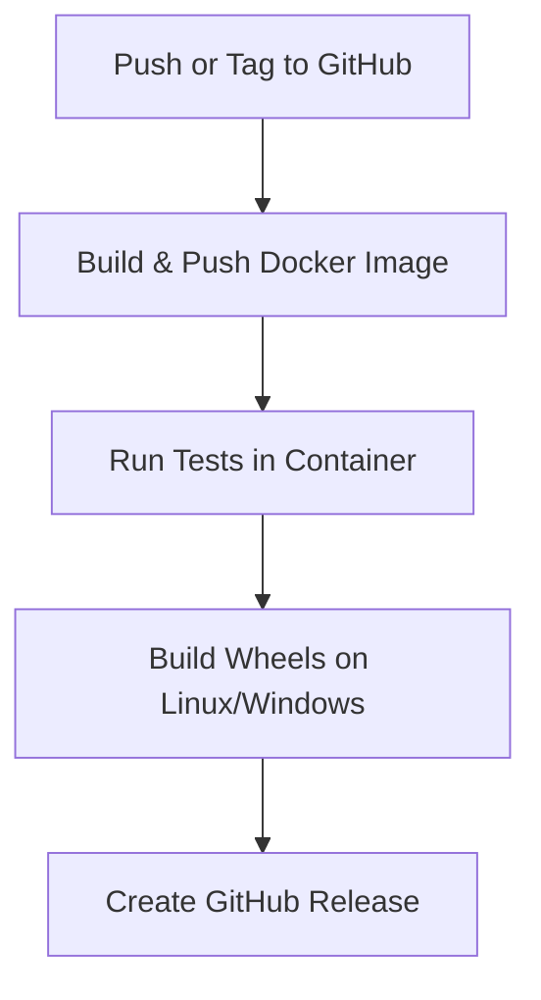

# MLC-LLM Studio

MLC-LLM Studio provides a fully automated pipeline to build, test and deploy the [MLC-LLM](https://llm.mlc.ai/) framework. The repository supplies a multipurpose Docker image for local development and CI builds, along with a GitHub Actions workflow that packages cross‑platform wheels and publishes them as GitHub releases.

---

## Features

- **Multipurpose Docker Image** – single image for development or production, published to GHCR.
- **Automated Tests** ensure the image works as expected.
- **CI/CD Pipeline** builds wheels for Linux and Windows and creates releases.

For detailed documentation see [docs/README.md](docs/README.md) and [docs/ci.md](docs/ci.md).

---

## Project Structure

```text
.
├── docker/                 # Dockerfile and helper scripts
├── docs/                   # Additional documentation and diagrams
├── python/                 # Source code of the mlc_llm Python package
├── scripts/                # Test and startup scripts
└── .github/workflows/      # CI configuration
```

---

## Architecture Diagrams

### Build & Deployment Flow


### CI/CD Architecture


### Model Deployment


---

## CI/CD Flow Summary



---

## Local Development

```bash
# Build the Docker image
docker build -t mlc-llm-dev -f docker/Dockerfile .

# Start an interactive shell with the repo mounted
docker run --rm -it -v "$PWD:/workspace" mlc-llm-dev bash
```

## Live Demo & Sample Output

The CI/CD pipeline deploys the Docker image to **Fly.io**. A **demo** server is
running at <https://mlc-llm.fly.dev/> using the quantized model
`Llama-2-7b-chat-glm-4b-q0f16_0`.

> **Note**
> This server is intended purely for demonstration. It runs with CPU only
> because GitHub Actions does not provide GPU runners. The underlying
> [MLC-LLM](https://llm.mlc.ai/) framework supports serving models on CPUs,
> GPUs and other accelerators.

To use a different model, set a `DEFAULT_MODEL` environment variable (or edit
`fly.toml`) and ensure `docker/entrypoint.sh` reads this value as shown in
[docs/ci.md](docs/ci.md#5-replacing-models).

```bash
curl https://mlc-llm.fly.dev/
# {"message":"MLC-LLM server running"}

curl -X POST https://mlc-llm.fly.dev/v1/chat/completions \
  -H "Content-Type: application/json" \
  -d '{
        "model": "Llama-2-7b-chat-glm-4b-q0f16_0",
        "messages": [
          {"role": "user", "content": "Hello, who are you?"}
        ]
      }'
# {"model":"Llama-2-7b-chat-glm-4b-q0f16_0","choices":[{"message":{"role":"assistant","content":"Hello! I am a test model response."}}]}
```

## Future Work

- Add optional Swagger UI (`/docs`) for interactive exploration.
- Deploy on GPU-backed nodes (AWS EC2/GCP) for realistic speed tests.
- Support switching models via the `DEFAULT_MODEL` environment variable.

---

Maintained by the MLC-LLM Studio contributors.

