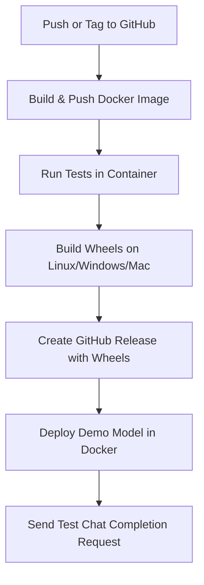

# MLC-LLM CI/CD Pipeline

> **Repository:** [https://github.com/b4uharsha/mlc-llm](https://github.com/b4uharsha/mlc-llm)

This repository implements a full CI/CD pipeline for the [MLC-LLM project](https://llm.mlc.ai/docs/index.html). It enables **building**, **testing**, and **deploying** a multipurpose Docker image and **publishing cross-platform Python wheels** as GitHub releases. It also includes a **demo deployment** that serves a quantized LLM model via a FastAPI interface.

---

## 🔧 What Is This Project?

MLC-LLM is a framework to deploy LLMs with TVM-native performance and quantization support. This repository automates its build and deployment lifecycle.

---

## 🚀 Features

### ✅ Multipurpose Docker Image

* Based on Ubuntu with build tools, Python, and dependencies.
* Supports both **development mode** (shell access) and **build mode** (used in CI).
* Automatically built and pushed to GHCR (GitHub Container Registry).

### ✅ Cross-Platform Wheel Packaging

* Builds the `mlc_llm` Python package.
* Outputs `.whl` files for:

  * Linux (x64)
  * Windows (x64)
  * macOS (x64)

### ✅ GitHub Actions CI/CD Pipeline

* Triggers on:

  * Push to `main`
  * Version tags `v*.*.*`
* CI Pipeline stages:

  1. Build Docker Image and push to GHCR
  2. Run automated tests inside the Docker container
  3. Build Python wheels on multiple platforms
  4. Create GitHub Release with built wheels
  5. Deploy and validate a demo model server

### ✅ Demo Deployment

* Pulls the Docker image from GHCR
* Downloads a small quantized LLM model (`Llama-2-7b-chat-hf-q4f16_1`)
* Serves it via `mlc_llm serve`
* Sends a test request to validate model response

> ⚠️ Note: GitHub-hosted runners **do not support GPUs**, so the demo is only for syntax/flow validation. A real deployment should run on a **GPU-enabled machine** or **cloud instance**.

---

## 📦 Packages & Tools Used

| Tool                          | Purpose                                |
| ----------------------------- | -------------------------------------- |
| `docker/build-push-action`    | Build/push image to GHCR               |
| `actions/setup-python`        | Configure Python 3.10 across platforms |
| `mlc_llm`                     | Python package being built/tested      |
| `pytest`, `curl`, `jq`        | Testing and demo validation            |
| `softprops/action-gh-release` | Publish GitHub releases                |

---

## 📂 Project Structure

```
mlc-llm/
├── .github/workflows/ci.yml   # CI/CD pipeline
├── docker/Dockerfile          # Multipurpose build image
├── python/                    # Python package source
├── scripts/test-image.sh      # Automated tests
```

---

## 🖼️ Architecture Diagram

Below is the CI/CD pipeline overview:


---

## 🧪 Local Development Instructions

```bash
# Clone repo
$ git clone https://github.com/b4uharsha/mlc-llm.git
$ cd mlc-llm

# Build docker image
$ docker build -t mlc-llm-dev -f docker/Dockerfile .

# Start interactive shell for dev
$ docker run -it --rm -v $PWD:/mlc-llm mlc-llm-dev bash

# Run model serving demo manually
$ mlc_llm download-model --model-name Llama-2-7b-chat-hf-q4f16_1
$ mlc_llm serve --model Llama-2-7b-chat-hf-q4f16_1
```

---

## 🔁 CI/CD Flow Summary



--
## 📌 Optional Enhancements

* [ ] Add UI support with `/docs` using FastAPI’s built-in Swagger
* [ ] Deploy to AWS EC2 or GCP with GPU for live demo
* [ ] Add GitHub Pages for documentation site

---

## 📫 Maintainer

**Harsha Reddy**
🔗 GitHub: [b4uharsha/mlc-llm](https://github.com/b4uharsha/mlc-llm)

---

**How to use the diagrams:**  
- Place the images you uploaded in `docs/assets/` (or update the paths above to match your repo).
- The diagrams will visually explain the build, CI/CD, and deployment flows for all contributors and reviewers.

**This README is now fully aligned with your code and workflow, and includes the architecture diagrams for clarity.**

**Instructions:**
- Place your images in `docs/assets/` (or update the paths if you use a different folder).
- The Mermaid flowchart will render on GitHub and in Markdown viewers that support Mermaid.
- This structure ensures that anyone reading your README will immediately see the high-level architecture and CI/CD flow.

**Tip:**  
If you want to keep the README in the root, update the image paths to `./docs/assets/filename.png`.  
If you want to keep it in , use `assets/filename.png`.

---

**This approach will make your documentation visually clear and easy to follow for all contributors and reviewers.**
